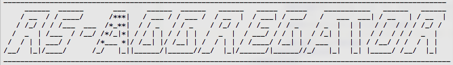

# rs-aggregator
Aggregate [ResourceSync](http://www.openarchives.org/rs/1.0.9/resourcesync) Sources

---
- The component in this repository is intended for system administrators and developers.
- Source location: [https://github.com/EHRI/rs-aggregator](https://github.com/EHRI/rs-aggregator).
- Documentation: [https://ehri.github.io/rs-aggregator/](https://ehri.github.io/rs-aggregator/).
- In case of questions [contact](https://github.com/EHRI/rs-aggregator/issues/new) the EHRI team.

---

The `Destination` in a 
[ResourceSync Framework](http://www.openarchives.org/rs/1.0.9/resourcesync) configuration keeps zero or 
more `sets of resources` from zero or more `Sources` synchronized. 
See also: [Definitions](http://www.openarchives.org/rs/1.1/resourcesync#Definitions).

`rs-aggregator` can be used, out-of-the-box, as such a `Destination` that aggregates `sets of resources`
from a list of `Sources`.

## Docker quick start

1. Clone this repository to your local drive.
```bash
git clone https://github.com/EHRI/rs-aggregator.git
```
2. Start a [Docker](https://www.docker.com/) daemon (if it is not already running) switch to the 
 `docker` directory and run the start-script.
```bash
cd rs-aggregator/docker
./start.sh
```
If you see the `rs-aggregator` logo...



then you have just built a Java8 capable docker container, imported required libraries,
compiled, tested and packaged the source code and started the rs-aggregator application.
To gracefully stop the aggregator (without interrupting a synchronisation run)
you can run the stop-script.
```bash
./stop.sh
```
The aggregated resources are in `docker/destination`, grouped by host name of the `Sources`.
`Sources` are synchronized per `set of resources` described by a `capabilityList`.
Each `set of resources` will be in a subdirectory contingent to the path that led to the
corresponding `capabilityList`. In this base directory you will find:

- `__MOR__` a directory containing the metadata: the `capabilityList` and its child-sitemaps.
- `__SOR__` a directory containing the `set of resources`.
- `__SYNC_PROPS__` a directory containing a report for each synchronisation run in the 
form of an xml-properties file.

## Quick configuration
The configuration files are in `cfg`. When running the Docker container `rs-aggregator` will 
look in `docker/cfg`.

### CapabilityList URI's
`cfg/uri-list.txt` &nbsp; | &nbsp; `docker/cfg/uri-list.txt`

Each `set of resources` is denoted by a distinguished `capabilityList`. The file
`cfg/uri-list.txt` should contain a list of URI's pointing to `capabilityLists` you
want to follow. This list is read each time before a synchronisation run, so changes
you make to the list are hot-deployed: you do not need to restart the aggregator.

### Application context
`cfg/syncapp-context.xml` &nbsp; | &nbsp; `docker/cfg/syncapp-context.xml`

The Spring configuration file. At this moment notable configuration details are:

- __job-scheduler__
    - See for available schedulers the package `nl.knaw.dans.rs.aggregator.schedule`.
    - See for available timer options the description on properties of the bean.
- __resource-manager__
    During synchronisation the `nl.knaw.dans.rs.aggregator.sync.SyncWorker` and companions 
    are doing all the heavy lifting, while The `nl.knaw.dans.rs.aggregator.syncore.ResourceManager`
    gets relatively easy to accomplish and simple tasks. An implementation of
    `resource-manager` is dedicated to a specific storage system for the aggregated
    resources. At this moment only the `nl.knaw.dans.rs.aggregator.sync.FsResourceManager` 
    is available, aimed at storing resources on the file system. 
